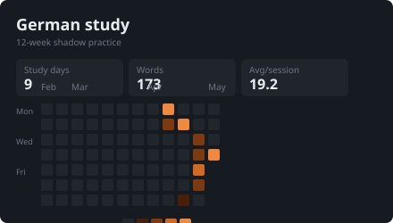

# German Shadow Practice

This repository is a local-first workflow for turning German shadowing transcripts into durable study assets. It keeps the process intentionally file-backed: raw transcripts stay in Markdown, long-lived learning items live in YAML, and review sessions are staged as editable drafts before any final state is changed.

The goal is not to build a full study app. The goal is to preserve useful phrases, words, and reusable speaking patterns from real listening material, then review them in a controlled loop without losing the original transcript context.



## Project Intent

The workflow supports four recurring jobs:

- `capture`: parse a raw transcript and stage candidate learning items.
- `commit`: promote reviewed staged items into the durable asset store.
- `review`: create a draft review session from durable assets.
- `report`: summarize review results and apply confirmed batch updates.

The important design choice is stage-first capture. A transcript capture creates a session file that can be pruned before commit. This keeps speculative recommendations separate from durable learning state, while still preserving repeated user-marked items as reset signals when they already exist in the asset store.

## Repository Layout

- `.agents/skills/`: local Codex skills that define the workflow contract.
- `raw-transcripts/`: source transcript files, usually with a `---` separator followed by user-marked must-keep bullets.
- `shadow_sessions/`: staged capture notes. These are the review surface before commit.
- `shadow_assets/assets.yaml`: durable learning assets.
- `shadow_reviews/review_state.yaml`: durable review state for each asset.
- `shadow_reviews/review_log.md`: human-readable commit and review history.
- `shadow_reviews/review_drafts/`: draft-only active review outputs.
- `scripts/`: helper scripts for commit and dashboard generation.
- `dashboard/`: read-only local dashboard for browsing committed assets.
- `docs/`: design notes, plans, and debug investigations.
- `tests/`: regression tests for helper scripts.

## Input Format

Capture input files live under `raw-transcripts/` and use this shape:

```text
<raw German transcript>

---
- must keep item 1
- must keep item 2
- must keep item 3
```

The transcript body is the source of context. The bullets after `---` are user-marked candidates, not final durable assets. During capture, each item is classified as `word`, `phrase`, or `pattern`, normalized when obvious, and linked back to a transcript sentence.

## Workflow

### 1. Capture a Transcript

Use the `shadow-capture` skill with a transcript file:

```text
[$shadow-capture](.agents/skills/shadow-capture/SKILL.md) [260426.md](raw-transcripts/260426.md)
```

Capture writes a session file under `shadow_sessions/YYYY-MM-DD-HHMM.md`. The session file is intentionally editable: remove candidates you do not want, keep recommendations you accept, and adjust wording before commit.

### 2. Commit Reviewed Items

Use the `shadow-commit` skill after the session file has been reviewed:

```text
[$shadow-commit](.agents/skills/shadow-commit/SKILL.md)
```

From the project root, the preferred executable path is the helper script:

```powershell
python scripts\shadow_commit.py
```

For an explicit session:

```powershell
python scripts\shadow_commit.py --session shadow_sessions\YYYY-MM-DD-HHMM.md
```

Commit behavior:

- New targets are appended to `shadow_assets/assets.yaml`.
- Matching review records are written to `shadow_reviews/review_state.yaml`.
- A compact commit entry is appended to `shadow_reviews/review_log.md`.
- Existing durable targets are not duplicated. They are reset to `status: new`, their `reset_count` is incremented, and their historical `review_count` is preserved.
- Dashboard follow-up runs by default.

Do not rerun the commit script against an already committed session unless idempotency has been added. Current behavior treats existing targets as repeated hits and appends another commit log entry.

### 3. Open the Dashboard

The dashboard is a read-only browser view over committed assets.

One-step launcher:

```powershell
pwsh -ExecutionPolicy Bypass -File scripts\start_shadow_dashboard.ps1
```

Manual rebuild and serve:

```powershell
python scripts\build_shadow_dashboard.py
python -m http.server 4173 --directory dashboard
```

Then open:

```text
http://localhost:4173
```

The dashboard data comes from `dashboard/data/dashboard-data.json`, generated from durable YAML state plus session context.

### 4. Review and Report

Use `shadow-review` to create a draft review session from durable assets. Review output is written under `shadow_reviews/review_drafts/` and does not directly mutate final state.

Use `shadow-report` after the review is finished. The report step summarizes solid items, weak items, mistakes, and proposed batch updates. Durable review state should only be changed after the user confirms the grouped updates.

## State Model

Each durable asset stores:

- `id`: stable asset identifier.
- `type`: `word`, `phrase`, or `pattern`.
- `title` / `content`: normalized learning target.
- `english`: compact transcript-specific gloss.
- `transcript_sentence`: original sentence for context.
- `collocation`: optional subordinate recall hook.
- `source_session`: staged session that produced or last reset the asset.
- `status`, `priority`, `review_count`, `reset_count`, `last_reviewed_at`, `mistake_note`.

`review_count` tracks completed review events. `reset_count` tracks repeated capture hits. Keep these histories separate.

## Development Commands

Run the commit tests:

```powershell
python -m pytest tests/test_shadow_commit.py -q
```

Check staged diff hygiene before committing:

```powershell
git diff --cached --check
```

The repository ignores Python caches, pytest cache directories, and local dashboard server logs.

## Operational Notes

- Prefer helper scripts over manual YAML edits for commit and dashboard refresh.
- If a helper script fails, isolate the failing boundary first: durable YAML write, dashboard data rebuild, server start, or browser open.
- Keep raw transcript files outside `shadow_sessions/`; session files should reference the source path instead of duplicating the full transcript.
- Keep recommendations conservative. The session note is the place to review them before commit.
- Do not silently suppress duplicate user-marked items. Duplicate capture is a learning signal and should become a reset candidate.
